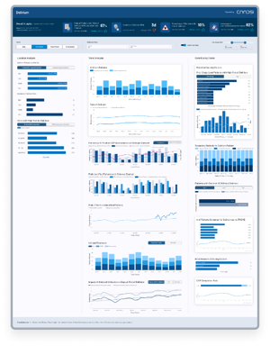

## Delirium: Proactive Intervention

## About This Project

### Purpose
Improve early detection and intervention for patients at risk of delirium.

### Key Features
- Real-time risk flagging using EHR data and AI prediction
- Visual tracking of interventions and care status
- Designed for clinical usability and rapid decision-making

### Impact
Enabled proactive, non-drug interventions and improved patient safety.

### Tools & Skills Used
| Tool/Skill              | Icon | Description                     |
|-------------------------|------|---------------------------------|
| SQL                     |  | Structured Query Language       |
| Power BI                |  | Business Intelligence Tool      |
| ETL/ELT                 |  | Data Integration Techniques     |
| Agile Methodology       | 🧭  | Iterative Project Management    |
| Stakeholder Engagement  | 🤝  | Communication & Collaboration   |

### GitHub Repository
https://github.com/evehliu/Delirium
