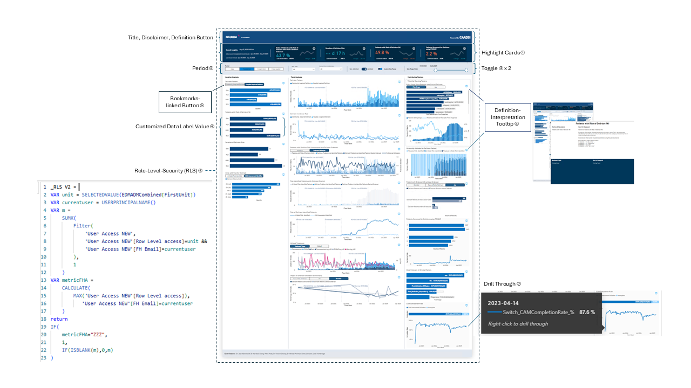

# The Delirium Project
A dashboard for delirium care, enabled by EHR, shows potential to help change trajectory for patients at risk of delirium.

## Purpose
Delirium is a widespread and underrecognized medical emergency. It affects up to **80% of ICU patients**, **15–25% of hospitalized elderly patients**, and **6–30% of non-ICU patients** overall. Despite its prevalence, it often goes undetected until it causes serious harm—prolonging hospital stays, increasing mortality, and leading to long-term cognitive decline. 
Every missed case of delirium is a missed opportunity for prevention and recovery. 
The Delirium Project uses machine learning and EHR data to predict risk early—offering a scalable, proactive solution to a persistent clinical blind spot.

## Features
- Real-time risk flagging using EHR data and AI prediction
- Visual tracking of interventions and care status
- Designed for clinical usability and rapid decision-making

## Impact
Enabled proactive, non-drug interventions and improved patient safety.

## Screenshots

## 🚀 Live Demo
[Try it now!](your-demo-link)

## Repository 
https://github.com/evehliu/Delirium

### Table of Contents
-  Dashboard
  - 📄 [README](https://github.com/evehliu/Delirium/blob/main/Dashboard/README.md)
  - 📁 PBIX Folder
  - 🖼️ [Dashboard Screenshot](screenshots/dashboard.png)
- Synthetic Dataset
  - 📚 [Dataset Documentation](https://github.com/evehliu/Delirium/blob/main/Synthetic%20Dataset/README.md)
  - 🐍 [Python Script](https://github.com/evehliu/Delirium/blob/main/Synthetic%20Dataset/generate_datasets.py)
  - 📊 [Sample Data](https://github.com/evehliu/Delirium/tree/main/Synthetic%20Dataset/Sample%20Data)
    
### Skills

   SQL &nbsp;
   Power BI &nbsp;
   ETL/ELT &nbsp;
  🧭 Agile &nbsp;
  🤝 Stakeholder Engagement

