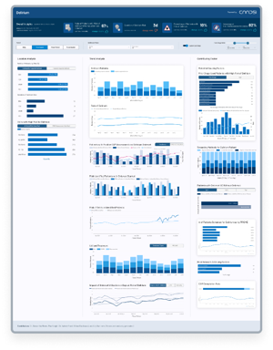

## Welcome to Delirium: Proactive Intervention

### Overview
This project aims to improve early detection and intervention for patients at risk of delirium using AI and real-time EHR data.

### Explore the Repository
- 📊 Dashboard
- 🧪 Synthetic Dataset
- 📁 Assets
- 📄 README

### GitHub Repository
Visit on GitHub 🐙 (https://github.com/evehliu/Delirium)
